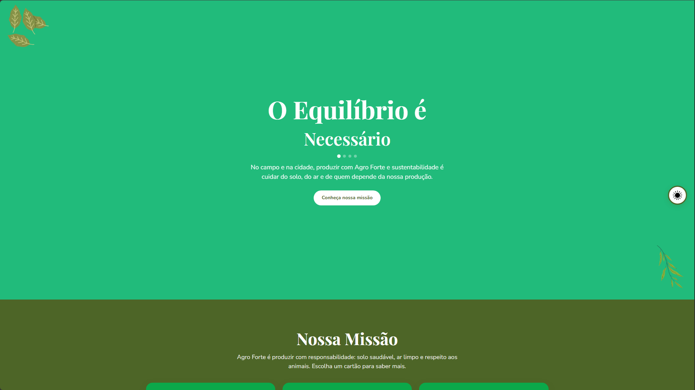

# O Equilíbrio é Necessário · Agrinho 2026

> Site educativo sobre **Agro Forte, futuro sustentável: equilíbrio entre produção e meio ambiente**. Três eixos — produção sustentável, ar limpo e bem-estar animal — com links para organizações que atuam em cada tema.

**Autor:** Brayan Wilian dos Santos de Souza  
**Escola:** Professora Linda Salamuni Bacila  
**Categoria:** Programação · Subcategoria 3 (HTML, CSS e JavaScript)

## 📸 Capturas de tela



## 🎯 Objetivo (tema Agrinho 2026)

Apresentar, de forma clara e acessível, como a produção agrícola pode ser **forte e sustentável** ao mesmo tempo: cuidar do solo e da água, garantir ar limpo no campo e na cidade e respeitar o bem-estar dos animais. O visitante navega pelos três eixos e encontra parceiros reais (Greenpeace, Instituto Ar, Limpa Brasil) para aprofundar cada assunto.

## 🛠️ Tecnologias

- **HTML5** — estrutura semântica (`header`, `main`, `section`, links e botões)
- **CSS3** — variáveis, Flexbox, media queries (mobile-first), módulos por componente
- **JavaScript** — manipulação do DOM, eventos e `localStorage` (sem frameworks)

## ✨ Funcionalidades

- Rotação automática de palavras no hero (Necessário / Possível / Urgente / De Todos), com **bolinhas clicáveis**
- Cartões da missão com âncoras e scroll suave para cada bloco temático
- Botão fixo para voltar ao topo após a seção Missão
- **Modo alto contraste** (botão flutuante, preferência salva no navegador)
- Links externos abertos em nova aba com `rel="noopener noreferrer"`
- Página de atribuições com créditos de imagens, fontes e parceiros

## 🧰 Ferramentas usadas

- [Canva](https://www.canva.com/) — layout, ilustrações e identidade visual ([design original](https://canva.link/5ee1v7fu2yyi9vc))
- [Google Fonts](https://fonts.google.com/) — Playfair Display e Nunito

## ▶️ Como executar

1. Clone ou baixe este repositório.
2. Abra `index.html` no navegador (Chrome, Firefox ou Edge).

Não é necessário servidor local. Também é possível acessar a versão publicada no link abaixo.

## 🌍 Demonstração online

- 🔗 **Site:** [https://brayansantossouza-dev.github.io/agrinho-2026/](https://brayansantossouza-dev.github.io/agrinho-2026/)
- 📦 **Repositório:** [https://github.com/brayansantossouza-dev/agrinho-2026](https://github.com/brayansantossouza-dev/agrinho-2026)

## 📁 Estrutura

```text
.
├── index.html
├── atribuicoes.html
├── img-projeto.png
├── README.md
├── LICENSE
└── src/assets/
    ├── css/
    │   ├── main.css
    │   ├── base/          (reset, variáveis, fontes, tipografia)
    │   ├── componentes/   (hero, missão, blocos, botões)
    │   ├── layout/        (rodapé, media queries, acessibilidade)
    │   └── utilitarios/   (alto-contraste)
    ├── js/
    │   ├── principal.js       (hero, seta subir, links externos)
    │   ├── acessibilidade.js  (modo alto contraste)
    │   └── atribuicoes.js
    └── images/            (ícones, decorações, logos PNG)
```

## 📋 Publicação (Agrinho 2026)

| Item | Status |
|------|--------|
| Repositório público | ✅ |
| Topic `agrinho` | ✅ |
| GitHub Pages no About | ✅ |
| Entrega na unidade Agrinho (Alura) | ✅ |

## 📄 Licença e créditos

Código sob **licença MIT** (2026, Brayan Wilian dos Santos de Souza). Detalhes de imagens, fontes e links externos em [`atribuicoes.html`](atribuicoes.html).
